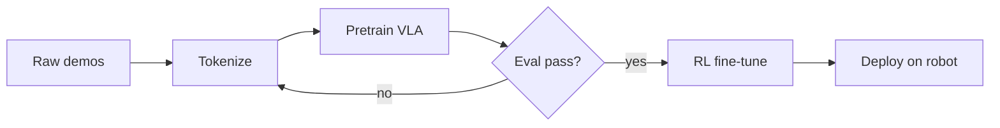

A short reference for myself (and anyone else writing here) on the syntax this Chirpy-themed blog supports. Add this front-matter to your post:

```yaml
---
title: "Your title"
date: 2026-04-26 12:00:00 +0800
categories: [Top, Sub]
tags: [tag1, tag2]
math: true        # only if you use LaTeX
mermaid: true     # only if you use mermaid diagrams
pin: true         # pin to the top of the homepage
image:
  path: /assets/img/cover.png
  alt: cover
---
```

## Math (LaTeX)

Inline: $\mathcal{L}(\theta) = \mathbb{E}_{\tau \sim \pi_\theta} [R(\tau)]$.

Display:

$$
\nabla_\theta J(\theta) \;=\; \mathbb{E}_{\tau \sim \pi_\theta}\!\left[\sum_{t=0}^{T} \nabla_\theta \log \pi_\theta(a_t \mid s_t) \, A^{\pi}(s_t, a_t)\right]
$$

The classic policy-gradient identity — the workhorse behind REINFORCE, A2C, PPO, and most of what we run in robot RL.

## Code blocks with line numbers

```python
import torch
import torch.nn as nn

class TinyPolicy(nn.Module):
    def __init__(self, obs_dim: int, act_dim: int, hidden: int = 256):
        super().__init__()
        self.net = nn.Sequential(
            nn.Linear(obs_dim, hidden), nn.SiLU(),
            nn.Linear(hidden, hidden),  nn.SiLU(),
            nn.Linear(hidden, act_dim),
        )

    def forward(self, obs: torch.Tensor) -> torch.Tensor:
        return torch.tanh(self.net(obs))
```

Shell snippets render fine too:

```bash
# launch a training run
python train.py --config configs/ppo_humanoid.yaml --seed 42
```

## Callouts

> Useful info — links, references, pointers to docs.
{: .prompt-info }

> A tip from experience — don't forget to seed your dataloaders.
{: .prompt-tip }

> Warning — this scales O(N²) in batch size; cap N or you'll OOM.
{: .prompt-warning }

> Don't do this on a production cluster without a dry run.
{: .prompt-danger }

## Mermaid diagrams



## Images

```markdown
{: width="600" }
_Caption goes here._
```

## Tables

| Method | Real-time? | Sample efficiency | Wall-clock |
|--------|:----------:|:-----------------:|:----------:|
| BC     | ✅         | high              | low        |
| PPO    | ❌         | low               | high       |
| Diffusion Policy | ✅ | medium          | medium     |

## Footnotes & definitions

The replay buffer[^buffer] stores transitions for off-policy learning.

[^buffer]: A FIFO data structure of `(s, a, r, s', done)` tuples, typically sized 1M for continuous control.

---

That's the kit. Now go write something.
